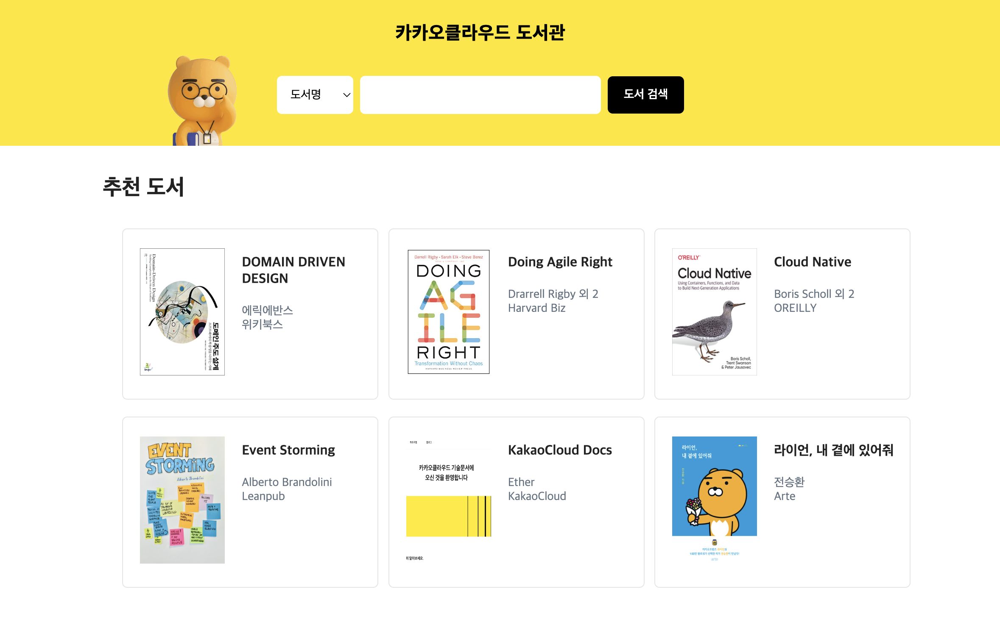

# KakaoCloud Library
이 프로젝트는 카카오클라우드 튜토리얼을 위한 예제 프로젝트입니다.



## Requirements
명령어를 실행하여 프로젝트를 실행하기 위한 요구사항이 준비되었는지 확인합니다.
1. **git**
    ```shell
    git version
    # git version 2.37.1
    ```
2. **docker**
    ```shell
    docker version
    # Version: 24.0.7
    ```
3. **docker-compose**
    ```shell
    docker-compose version
    # Docker Compose version v2.23.3-desktop.2
    ```

## Quick Start (docker-compose)
프로젝트를 빠르게 시작하기 위해, 아래의 절차를 따라하세요.
1. 깃을 통해 프로젝트를 설치합니다.
   ```shell
   git clone https://github.com/kakaoenterprise/kakaocloud-tutorials -b kakaocloud-library
   ``` 
2. 작업 디렉토리를 프로젝트 경로로 이동합니다.
    ```shell
    cd ./kakaocloud-library
    ```
3. docker-compose를 통해 프로젝트를 실행합니다.
    ```shell
    docker-compose up -d
    ```


## Deployment
프로젝트를 배포하기 위해 아래의 단계를 따라하세요.
1. 깃을 통해 프로젝트를 설치합니다.
   ```shell
    git clone https://github.com/kakaoenterprise/kakaocloud-tutorials -b kakaocloud-library
   ``` 
2. 작업 디렉토리를 프로젝트 경로로 이동합니다.
      ```shell
    cd ./kakaocloud-library
     ```
3. 어플리케이션, 환경 변수, 명령어 정보를 확인하고 명령어를 통해 어플리케이션을 배포합니다.

### Server
#### 환경 변수

| 변수 이름         | 설명                                     | 기본 값      |
|---------------|----------------------------------------|-----------|
| `PROFILE`     | Application profile (e.g. local, dev ) | dev       |
| `MYSQL_HOST`  | MySQL host address and port            | localhost |
| `DB_NAME`     | Database name                          | library   |
| `DB_USERNAME` | Database username                      | user      |
| `DB_PASSWORD` | Database password                      | password  |
| `REDIS_HOST`  | Redis host                             | localhost |
| `REDIS_PORT`  | Redis port                             | 6379      |

#### 명령어
```shell
docker run -it \
  -e MYSQL_HOST=${MYSQL_HOST} \
  -e DB_NAME=${DB_NAME} \
  -e DB_USERNAME=${DB_USERNAME} \
  -e DB_PASSWORD=${DB_PASSWORD} \
-p 8080:8080 \
--name kakaocloud-library-server -d \
$(docker build -q -f ./server/deploy/Dockerfile ./server)
```


### Client
#### 환경 변수

| 변수 이름             | 설명                      | 기본 값                  |
|-------------------|-------------------------|-----------------------|
| `SERVER_ENDPOINT` | Server endpoint address | http://localhost:8080 |


#### 명령어
```shell
docker run -it \
  -e SERVER_ENDPOINT=${SERVER_ENDPOINT} \
-p 80:80 -p 443:443 \
--name kakaocloud-library-client -d \
$(docker build -q -f ./client/deploy/Dockerfile ./client)
```
